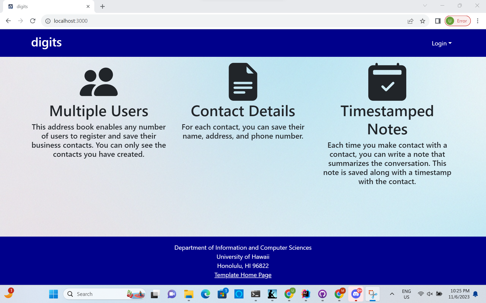
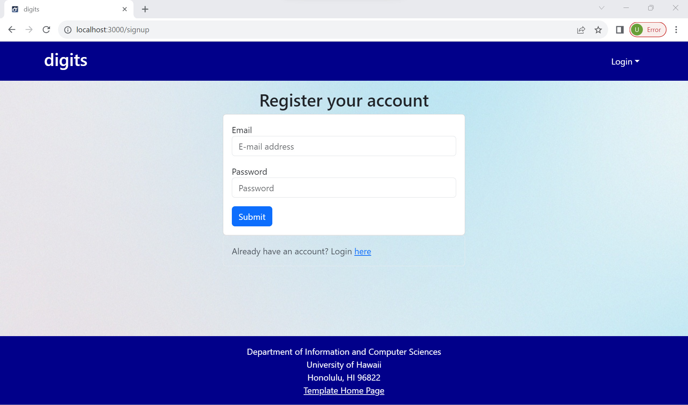
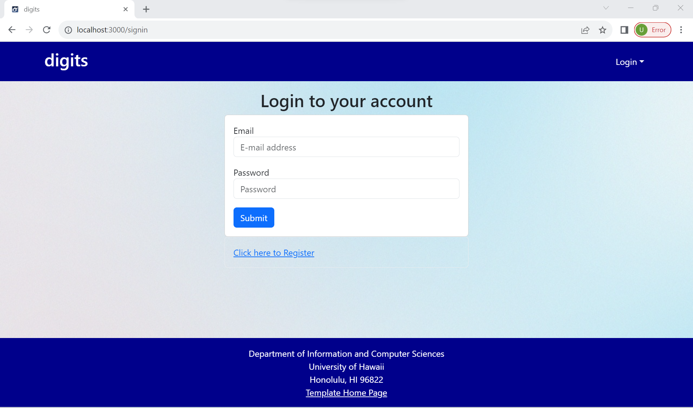
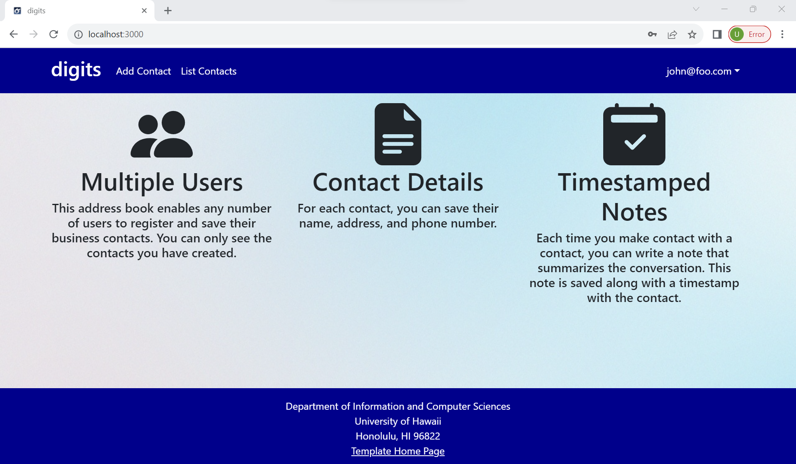
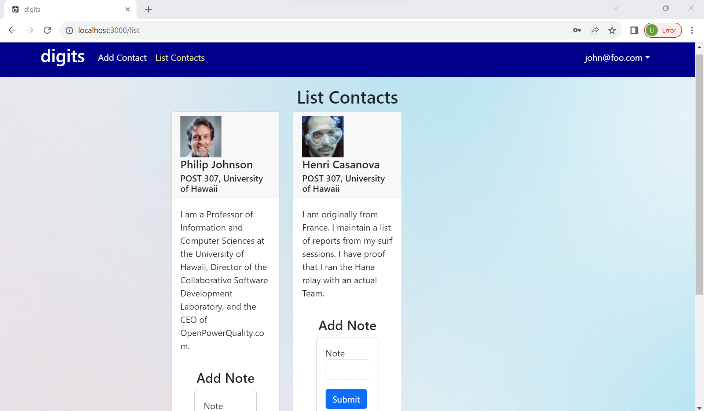
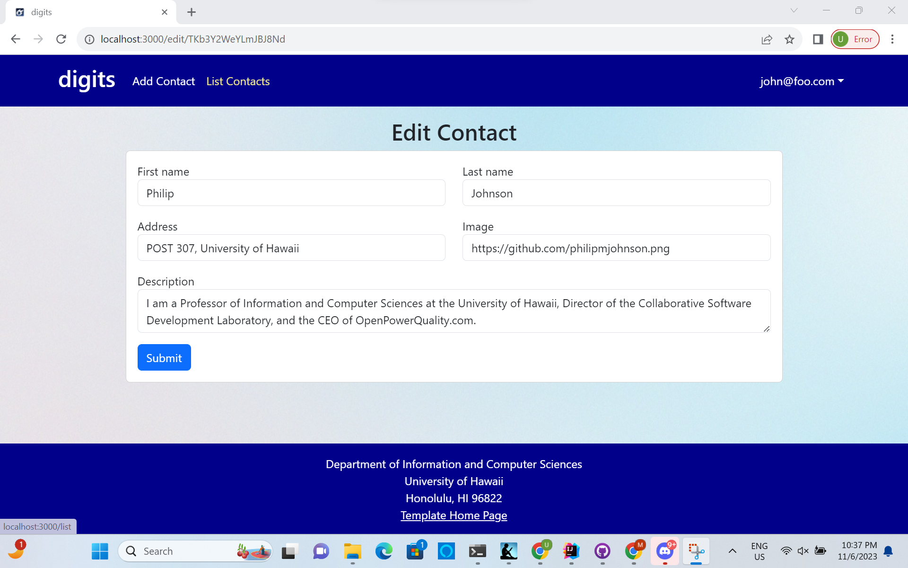
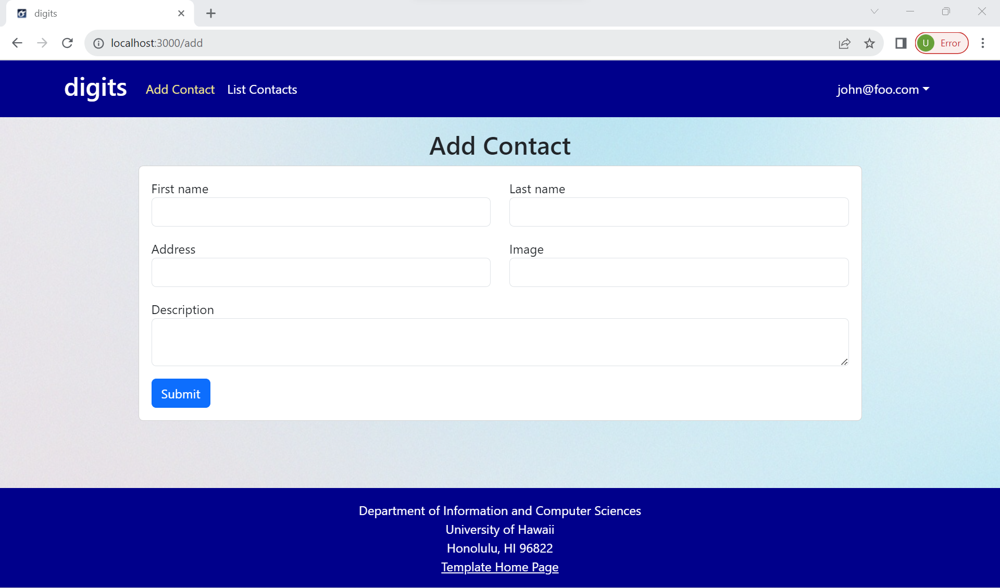

# digits



Digits is an application that allows users to:

  * Create an account
  * Create and manage a set of professional contacts
  * Add a set of notes to a contact that detail timestamped interactions

Examples of the these capabilities will be provided elsewhere.

## Installation

First, [install Meteor](https://www.meteor.com/install).

Second, go to [https://github.com/ics-software-engineering/meteor-application-template-react](https://github.com/ics-software-engineering/meteor-application-template-react), and click the "Use this template" button. Complete the dialog box to create a new repository that you own that is initialized with this template's files.

Third, go to your newly created repository, and click the "Clone or download" button to download your new GitHub repo to your local file system.  Using [GitHub Desktop](https://desktop.github.com/) is a great choice if you use MacOS or Windows.

Fourth, cd into the app/ directory of your local copy of the repo, and install third party libraries with:

```
$ meteor npm install
```

## Running the system

Once the libraries are installed, you can run the application by invoking the "start" script in the [package.json file](https://github.com/ics-software-engineering/meteor-application-template-react/blob/master/app/package.json):

```
$ meteor npm run start
```

The first time you run the app, it will create some default users and data. Here is the output:

```
 meteor npm run start 

> meteor-application-template-react@ start /Users/carletonmoore/GitHub/ICS314/meteor-application-template-react/app
> meteor --no-release-check --exclude-archs web.browser.legacy,web.cordova --settings ../config/settings.development.json

[[[[[ ~/GitHub/ICS314/meteor-application-template-react/app ]]]]]

=> Started proxy.                             
=> Started HMR server.                        
=> Started MongoDB.                           
I20220529-12:09:18.384(-10)? Creating the default user(s)
I20220529-12:09:18.389(-10)?   Creating user admin@foo.com.
I20220529-12:09:18.453(-10)?   Creating user john@foo.com.
I20220529-12:09:18.515(-10)? Creating default data.
I20220529-12:09:18.515(-10)?   Adding: Basket (john@foo.com)
I20220529-12:09:18.599(-10)?   Adding: Bicycle (john@foo.com)
I20220529-12:09:18.600(-10)?   Adding: Banana (admin@foo.com)
I20220529-12:09:18.601(-10)?   Adding: Boogie Board (admin@foo.com)
I20220529-12:09:18.773(-10)? Monti APM: completed instrumenting the app
=> Started your app.

=> App running at: http://localhost:3000/
```

### ESLint

You can verify that the code obeys our coding standards by running ESLint over the code in the imports/ directory with:

```
meteor npm run lint
```

## User Interface Walkthrough

### Exploring the landing page

If all goes well, the homepage will appear at [http://localhost:3000](http://localhost:3000).  


This page will provide a brief introduction to the capabilities of Digits.

### Sign Up



Making an account for first-time users is super easy! Just click the "Login" button then click "Sign Up." After filling out the form, you can use this account to Login.

### Sign In



Click on the Login button, then click on the Signin button to bring up the page above.

### User Home Page



After logging in, you will be redirected to the landing page with some options at the top that will take you to other pages.

### List Contacts



The List Contacts page will list all of the contacts associated with the logged in user. You can also add timestamped notes by filling out the form.

### Edit Contacts



Clicking the "Edit" button will bring up this page. Here, you can change the information associated with any of your contacts.

### Add Contacts



Adding a new contact is as easy as clicking the "Add Contact" link and filling out the form above. Once you press submit, your contact will be saved for future use.


